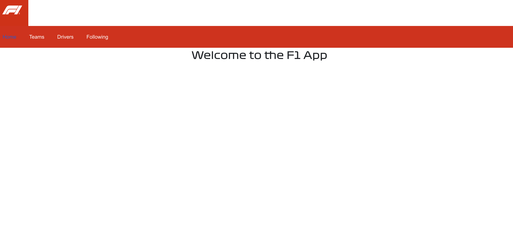

# F1 App - Frontend

#### The frontend of a full-stack application built as Project 3, a group project.

## DESCRIPTION 
F1 App - Frontend is one half of the F1 application designed to allow F1 fans to follow and learn more about their favorite F1 teams and drivers. 

## TABLE OF CONTENTS
* [Technologies Used](#technologiesused)
* [Project Management](#projectmanagement)
* [Features](#features)
* [Installation Instructions/Getting Started](#installation-instructionsgetting-started)
* [Deployed Frontend](#deployedfrontend)

## TECHNOLOGIES USED: 
* HTML5 
* CSS Grid 
* JavaScript 
* React
* React-Router 

## PROJECT MANAGEMENT 
* Trello: [https://trello.com/b/Dzt5wImz/general-assembly-project-3] (https://trello.com/b/Dzt5wImz/general-assembly-project-3)

## FEATURES
* Users can view navigate through header tabs to view F1 drivers and teams
* Users can create a favorite list and read, update, or delete drivers or teams they'd like to follow. 

## INSTALLATION INSTRUCTIONS/GETTING STARTED
* Fork the Frontend Repository 

 

* Copy that Repository code 

* Clone the Repository to your local machine by typing git clone (+url) and hit enter 

 

* Once the repository has been cloned, cd into it and `npm install` to download all dependencies

 
 
* This should download any and all dependencies affliated with the file, however, if it does not, `npm i` the following dependencies: 
        - axios 
        - react
        - react-dom 
        - react-router-dom
        - react-toastify

 

* Once downloaded, start the server by typing `npm run dev` into the IDE's terminal 

* A working server will feature a messsage such as the example below: 

 

 Click the localhost:5173 (or applicable number) link to take you to the main page:

  

## DEPLOYED FRONTEND
The Frontend of the F1 App can be accessed via this link: [https://main--f1frontendd.netlify.app/] (https://main--f1frontendd.netlify.app/) 